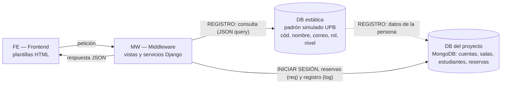

# Reserva de Salas de Estudio — UPB Santa Cruz

Proyecto **P02 — Reservas de salas e instalaciones** de Ingeniería de Software, adaptado a las salas de estudio de la UPB Santa Cruz.

Hoy las reservas de salas llegan por mensajes, lo que provoca cruces de horario y cancelaciones que no se reflejan a tiempo. El sistema registra salas, estudiantes y reservas, y aplica las reglas acordadas con el docente (que actúa como cliente) **antes** de confirmar una reserva.

- **Estado:** incremento de las sesiones 8 y 9 (modificar una reserva). Última actualización: 07/10/2026.
- **Tecnología:** Python 3, Django 5.2 y MongoDB (`django-mongodb-backend`), Tailwind CSS (mobile-first) y pruebas con pytest.
- **Datos:** todos los datos de demostración son ficticios.

## Integrantes

| Integrante | Rol principal |
|---|---|
| Raúl Vaca | Backend: reglas de negocio, pruebas e integración |
| Hugo Zúñiga | Arquitectura Django + MongoDB actual y pantallas (`login`, `inicio`, panel de administrador) |
| Alejandro Párraga | Frontend (sin disponibilidad para el incremento 8-9; la tarea C la asumió Raúl) |

Docente y cliente: Ing. Sergio Barrientos.

## Arquitectura

Recorrido que explicó el docente en la pizarra, con la aclaración del 07/10/2026: el padrón estático (que simula el de la universidad, con 19 personas ficticias: estudiantes de pregrado, postgrado y doctorado, un docente y tres administradores) se consulta **solo al registrarse**. Después, la persona ya está en la base del proyecto y **iniciar sesión** no vuelve a tocar el padrón.



| Recorrido | Camino | Dónde |
|---|---|---|
| Registro (una sola vez) | FE → MW → DB estática (padrón) → DB del proyecto | `/registro/`, `reservas/padron.py` |
| Iniciar sesión | FE → MW → DB del proyecto | `/login/`, `reservas/autenticacion.py` |
| Reservar, modificar, cancelar | FE → MW → DB del proyecto | `reservas/views.py`, `reservas/services.py` |

| Capa | Dónde está en el código | Estado |
|---|---|---|
| FE | `reservas/templates/web/` con Tailwind (`reservas/static/css/tailwind.css`) | Hecho: login, agenda del estudiante (con modificar reserva) y panel de administrador, adaptados a celular |
| MW | `reservas/views.py` (vistas y APIs JSON), `reservas/services.py` (reglas), `reservas/permisos.py` | Hecho; la modificación de reservas se agregó en este incremento |
| DB estática (padrón) | `datos/padron_upb.json` (19 personas ficticias con rol y nivel, solo lectura) y `reservas/padron.py` | Hecho: se consulta solo al registrarse |
| DB del proyecto | `reservas/models.py`: `Estudiante`, `Sala`, `Reserva` | Hecho (MongoDB) |

> Hay dos capas con las mismas reglas de creación: `reservas/services.py` (la usan `poblar_bd` y la modificación) y `proyecto/clases/` (la usan la API de reservar y las pruebas anteriores). Unificarlas es un pendiente.

## Qué hace hoy

| Requisito del encargo | Estado |
|---|---|
| RES-01 Registrar espacios y solicitantes | Parcial: salas (nombre y mantenimiento) y estudiantes. Falta la **capacidad** de la sala. |
| RES-02 Consultar disponibilidad | Parcial: calendario por fecha y sala. Sin filtro por capacidad. |
| RES-03 Crear reserva | Parcial: estudiante, sala, fecha y horario. Faltan los **asistentes**. |
| RES-04 Reglas antes de confirmar | Parcial: 15 min de desalojo, sin cruces del mismo estudiante, matrícula al día, sala sin mantenimiento, sala según el nivel y anticipación para reservar. Falta capacidad. |
| RES-05 Modificar o cancelar | Hecho: cancelar, y **modificar** con backend, pruebas y pantalla (botón "Modificar" y pregunta "¿Deseas mantenerla?"). |
| RES-06 Bloqueos de mantenimiento | Parcial: una sala se pone o se quita de mantenimiento. No hay bloqueos por período ni se cancelan las reservas afectadas. |
| RES-07 Corregir con motivo e historial | Pendiente. |
| RES-08 Agenda, activas y cancelaciones | Parcial: calendario del día y registro de reservas en el panel de administrador, con filtro por estado. |

Reglas aprobadas por el docente: ver [`docs/sesion-06-requisitos.md`](docs/sesion-06-requisitos.md). Modelo del flujo de modificación: [`docs/sesion-07-modelos.md`](docs/sesion-07-modelos.md). Plan del incremento: [`docs/sesion-08-09-plan.md`](docs/sesion-08-09-plan.md).

## Interfaz: Tailwind CSS y diseño mobile-first

**Por qué mobile-first.** La interfaz debe ser mobile-first (requisito del proyecto). Además, los estudiantes reservan desde el celular, entre clases o en el pasillo. Por eso cada pantalla se diseña primero para un ancho de unos 390 px y después se amplía:

| Pantalla | Celular | Escritorio |
|---|---|---|
| Agenda (`inicio`) | Una sala a la vez (pestañas) con sus bloques en lista; el formulario de reserva sube desde abajo | Tabla con todas las salas y el formulario fijo a la derecha |
| Modificar reserva | Diálogo que sube desde abajo; botones grandes (mínimo 44 px de alto) | Diálogo centrado |
| Panel de administración | Reservas como tarjetas | Reservas en tabla |

**Por qué Tailwind.** Las clases de Tailwind van en la misma plantilla, así que el diseño adaptable se escribe con prefijos (`md:`, `lg:`) sin mantener un archivo CSS aparte. Tailwind solo genera las clases que se usan, y el CSS compilado pesa unos 27 KB.

**No hace falta Node para ejecutar el proyecto.** El CSS compilado (`reservas/static/css/tailwind.css`) está en el repositorio. Node solo se necesita si se cambian clases en las plantillas:

```powershell
npm install
npm run css
```

La fuente de estilos y los colores del proyecto están en `reservas/static/src/tailwind.css`.

## Instalación

Guía completa, con tres formas de tener MongoDB (Atlas, Docker o instalación local): [`docs/SETUP.md`](docs/SETUP.md). Resumen para Windows y PowerShell:

```powershell
git clone https://github.com/raulandres24/campus-challenge-equipo-01
cd campus-challenge-equipo-01
python -m venv .venv
.venv\Scripts\Activate.ps1
python -m pip install -r requirements.txt
Copy-Item .env.example .env      # luego elige tu MONGO_URI dentro del archivo
python manage.py migrate
python manage.py poblar_bd
```

MongoDB debe funcionar como **replica set** (`rs0`); `docker compose up -d` lo deja listo, y MongoDB Atlas ya lo es.

## Ejecución

```powershell
python manage.py runserver
```

Abre <http://127.0.0.1:8000/>. Hay **un solo inicio de sesión** para todos: código (5 dígitos), correo institucional y contraseña. No hay pantallas ni pestañas distintas según el rol. Con `DEBUG` activo, la pantalla trae botones de demostración (contraseña `password`, **solo para desarrollo**).

**Primero se registra** (una sola vez, en `/registro/`): la persona escribe su código y su correo, el sistema los busca en el padrón y, si figuran y el registro está activo, elige su contraseña. **Después inicia sesión** con esos tres datos; el padrón ya no interviene.

`poblar_bd` deja registradas las cuentas de demostración, todas con la contraseña `password`:

| Persona | Código | Correo | Qué muestra |
|---|---|---|---|
| Lucía (pregrado) | `94210` | `lucia.mendez@est.upb.example` | Reserva en las salas B, C, D, F, H y J |
| Carlos (pregrado) | `94377` | `carlos.torrico@est.upb.example` | Entra pero no puede reservar: matrícula no vigente |
| Patricia (postgrado) | `81247` | `patricia.aguilera@est.upb.example` | Reserva solo las salas A y E |
| Elena (doctorado) | `72118` | `elena.montano@est.upb.example` | Reserva solo las salas A y E |
| Docente | `20011` | `sergio.barrientos@upb.example` | Panel de administración |
| Administradores | `20012`, `20013`, `20014` | `hugo.zuniga@`, `raul.vaca@`, `alejandro.parraga@` + `upb.example` | Panel de administración |

Para probar el **registro** quedan sin cuenta: Diego (`92956`, `diego.suarez@est.upb.example`, pregrado) y Gonzalo (`72593`, `gonzalo.peredo@est.upb.example`, doctorado). Sebastián (`92604`, `sebastian.gutierrez@est.upb.example`) está inactivo en el padrón y **no puede registrarse**.

El sitio `/admin/` de Django sigue con usuario y contraseña: `poblar_bd` crea el superusuario `admin` (contraseña `password`, solo desarrollo) únicamente para eso.

### Salas por nivel académico

| Salas | Quién las reserva |
|---|---|
| B, C, D, F, H y J | Estudiantes de **pregrado** |
| A y E | Estudiantes de **postgrado y doctorado** (salas exclusivas) |

La regla está en `reservas/niveles.py` y se aplica al crear la reserva; cada estudiante ve en la agenda solo las salas de su nivel. Por ahora postgrado y doctorado **no** reservan las salas de pregrado: es una decisión provisional hasta preguntarle al docente (si responde que sí, es una línea en `nivel_puede_usar_sala`). Los administradores ven todas las salas.

### Anticipación para reservar

Regla del docente (07/10/2026), con los días de clase de **lunes a viernes**:

| Nivel | Cuándo puede reservar | Ejemplos |
|---|---|---|
| Postgrado y doctorado | Hasta **2 días de clase** adelante, a cualquier hora, todo el día | Desde el lunes (a cualquier hora): martes y miércoles. Desde el viernes: lunes y martes |
| Pregrado | Las reservas de un día se abren a las **18:00 del día de clase anterior** | Lunes a las 18:00: ya puede reservar el martes, a cualquier hora. Viernes a las 18:00: ya puede reservar el lunes |

La regla está en `reservas/ventanas.py` (funciones puras, con pruebas sin MongoDB) y se aplica en la API al **reservar** y al **modificar** (si el estudiante cambia la fecha). La agenda le muestra a cada estudiante "Puedes reservar hasta el …". **El docente y los administradores no tienen este límite.** No va dentro de `services.py` porque depende de quién pide (un administrador queda fuera) y para que `poblar_bd` pueda crear reservas de ejemplo para varios días.

Interpretaciones que se tomaron y hay que confirmar con el docente: se puede reservar para hoy; los sábados y domingos no se bloquean (P9); los administradores quedan fuera (P10); y pregrado puede reservar el mismo día hasta que empiece el bloque (P12). El docente dijo primero "24 horas antes" y "desde las 21:00"; la respuesta del 07/10/2026 reemplaza ambas.

### Padrón simulado y registro

`datos/padron_upb.json` simula el padrón de la universidad (la "DB estática" de la pizarra). Cada persona trae `codigo` (5 dígitos), `nombres`, `apellidos`, `email`, `rol` (`estudiante`, `docente` o `admin`), `nivel` (`pregrado`, `postgrado` o `doctorado`; vacío para el personal), `carrera`, `activo` y `matricula_vigente`. **No guarda contraseñas**: cada persona elige la suya al registrarse y Django guarda solo su *hash*, en la base del proyecto. Todos los datos son ficticios y los correos usan el dominio reservado `.example`, que no existe.

Al **registrarse** (`/registro/`):

| Situación | Resultado |
|---|---|
| El código no tiene 5 dígitos | No se registra: "El código tiene 5 dígitos…" |
| El código y el correo no figuran juntos en el padrón | No se registra: "No figuras en el padrón…" |
| Figura, pero `activo` es `false` | No se registra: "Tu registro no está activo" |
| Ya existe una cuenta con ese código | No se registra: "Ese código ya tiene una cuenta" (nadie puede cambiar la contraseña de otro) |
| La contraseña es débil o no coincide con su repetición | No se registra: se aplican las reglas de contraseña de Django (mínimo 8 caracteres, no común, no solo números, no parecida al nombre o al correo) |
| Todo bien | Se crea su cuenta (username = código). Si es estudiante, también su `Estudiante` con el **nivel** y la **matrícula vigente** que decía el padrón en ese momento. Docente y administradores quedan con permisos de gestión (`is_staff`); el padrón nunca da superusuario |

Al **iniciar sesión** (`/login/`) solo se mira la base del proyecto. Si el código, el correo o la contraseña no coinciden, o no hay cuenta, el mensaje es siempre el mismo ("Código, correo o contraseña incorrectos") para no revelar qué códigos tienen cuenta. Estar en el padrón no basta: hay que registrarse. Una persona con matrícula no vigente entra y ve la agenda, pero no puede reservar (regla "solo matrícula al día").

Un estudiante solo reserva a su nombre: el código sale de su sesión, no del formulario. Como el nivel y la matrícula se copian al registrarse, un cambio posterior en el padrón no se refleja solo (ver pregunta P11). Si alguna vez se necesitan otros datos, van en `datos/padron_local.json`, que git ignora.

### API para modificar una reserva

`POST /api/modificar-reserva/` (sesión iniciada) con `reserva_id`, `fecha` (`AAAA-MM-DD`), `hora_inicio` y `hora_fin` (`HH:MM`). Puede hacerlo el dueño de la reserva o un administrador.

| Resultado | Respuesta |
|---|---|
| Aceptada | `estado: "CONFIRMADA"` y los datos nuevos de la reserva |
| Rechazada por reglas | `estado: "RECHAZADA"`, la causa en `mensaje`, `preguntar_mantener: true`, `pregunta: "¿Deseas mantenerla?"` y los datos originales (sin cambios). Si el estudiante responde "No" o Esc, la pantalla llama a `/api/cancelar/`. |
| La reserva ya comenzó | `estado: "RECHAZADA"` con `preguntar_mantener: false` |
| Datos mal escritos / sin permiso | HTTP 400 / HTTP 403 |

## Pruebas

```powershell
python -m pytest -q
```

Las pruebas que usan MongoDB trabajan sobre una base aparte, `test_<MONGO_DB_NAME>`, que se crea y se borra en cada corrida: **la base real no se modifica**. Las pruebas puras corren sin MongoDB:

```powershell
python -m pytest -q tests/test_urls.py tests/test_agenda.py
```

| Archivo | Qué prueba |
|---|---|
| `tests/test_unitarios_simples.py` | Horarios, validación de estudiante y sala, permisos |
| `tests/test_integracion_completa.py` | Crear, rechazar y cancelar reservas en MongoDB |
| `tests/test_reglas.py` | Reglas de la versión orientada a objetos |
| `tests/test_modificar_reserva.py` | RES-05: casos normal, borde, límite de 15 min, rechazo con la reserva intacta, reserva ya iniciada, reintento y API |
| `tests/test_urls.py` | Botón "Salir" (cerrar sesión) |
| `tests/test_padron.py` | Padrón ficticio (códigos de 5 dígitos, sin contraseñas), registro (padrón, roles, contraseñas, doble registro), inicio de sesión que **no consulta el padrón**, mensajes de error y reservas solo a nombre propio |
| `tests/test_ventanas.py` | Anticipación para reservar: postgrado y doctorado (2 días de clase), pregrado (desde las 18:00), fines de semana, zona horaria, administradores sin límite y modificar fuera de la ventana |
| `tests/test_niveles.py` | Salas por nivel: pregrado en B, C, D, F, H y J; postgrado y doctorado en A y E; cada estudiante ve solo sus salas |
| `tests/test_agenda.py` | Agenda del día (reservas fuera de bloque, mantenimiento) y botón "Modificar" en la pantalla |

## Estructura

```text
reservas_upb/     Configuración de Django (settings, URLs raíz)
reservas/         App principal: modelos, vistas, servicios (reglas), agenda, permisos, plantillas
reservas/static/  CSS de Tailwind (src/ = fuente, css/ = compilado)
proyecto/clases/  Funciones de negocio usadas por la API de reservar y por las pruebas anteriores
tests/            Pruebas con pytest
docs/             Requisitos, modelos, planes por sesión y guía de instalación
docker-compose.yml  MongoDB local con replica set rs0
package.json      Solo para recompilar el CSS de Tailwind
```

## Bitácora de decisiones

Cada fila dice qué se decidió, por qué, cómo va y **qué respondió el docente y cuándo**. La última columna evita confundir respuestas cuando varias llegan el mismo día. «—» significa que la decisión fue del equipo y no dependió de una respuesta del docente.

| Fecha | Decisión | Motivo | Estado | Respuesta del docente (fecha y texto) |
|---|---|---|---|---|
| 30/09/2026 y 01/10/2026 | Raúl pidió al docente acceso al padrón de estudiantes de la UPB. | Validar que quien reserva existe y tiene matrícula vigente. | Respondida el 02/10/2026. | Respuesta dada el 02/10/2026: «No usar el padrón real: usar una base estática con los estudiantes del aula». |
| 01/10/2026 | Reglas aprobadas por el docente: 15 min de desalojo, sin cruces del mismo estudiante, solo matrícula al día, no modificar una reserva iniciada, "¿Deseas mantenerla?" ante un cambio rechazado, gana la primera solicitud y el mantenimiento cancela reservas afectadas. | Entrevista con el cliente (sesión 6). | Aprobadas; varias siguen pendientes de implementar (ver "Qué hace hoy"). | Respuesta dada el 01/10/2026 (entrevista, sesión 6): las reglas de la columna Decisión. |
| 01/10/2026 | Se conecta Django con MongoDB (`django-mongodb-backend`), en lugar de MySQL/MariaDB que menciona el encargo. | El docente confirmó que se puede usar MongoDB con Django. | **Aprobado** (07/10/2026). | Respuesta dada el 07/10/2026: «Sí se puede usar MongoDB junto con Django». |
| 02/10/2026 | **No usar el padrón real**: usar una base estática con los estudiantes del aula. | Indicación del docente (pizarra: FE → MW → DB estática → DB del proyecto). | Hecho el 07/10/2026 (ver más abajo). | Respuesta dada el 02/10/2026 (pizarra): el recorrido FE → MW → DB estática → DB del proyecto. |
| 02/10/2026 | Raúl usó Tailwind CSS en sus plantillas; Hugo hizo las suyas con CSS propio, sin Tailwind. | Dos estilos de trabajo en paralelo. | Resuelto el 07/10/2026 (ver más abajo). | — |
| 02/10/2026 | Hugo reescribió el proyecto a su estilo; `main` perdió el trabajo posterior de Raúl (login por padrón, roles, capacidad, Tailwind). Ese trabajo quedó en la rama local `respaldo-raul`. | Reescritura sin integración previa. | El equipo se adapta a la versión de Hugo y porta lo útil desde `respaldo-raul`. | — |
| 02/10/2026 | Modelo del flujo "modificar una reserva" (RES-CU-01). | Sesión 7. | Vigente. | — |
| 06/10/2026 | Alcance y plan del incremento de las sesiones 8 y 9: modificar una reserva (RES-05). | Sesiones 8-9. | Hecho el 07/10/2026 (backend y pantalla). | — |
| 07/10/2026 | Arreglo del botón "Salir": se quitó `django.contrib.auth.urls`, cuyos nombres `login` y `logout` tapaban a los del proyecto. | El enlace llevaba a `/accounts/logout/`, que solo acepta POST (error 405). | Hecho. | — |
| 07/10/2026 | Las pruebas usan una base aparte (`test_...`) que se borra al terminar. | El encargo pide probar sin modificar una base real. | Hecho. | — |
| 07/10/2026 | `requirements.txt` pasa de UTF-16 a UTF-8 y se agrega `docker-compose.yml`; se recomienda MongoDB Atlas para quien instala por primera vez. | Instalación reproducible para el docente. | Hecho. | — |
| 07/10/2026 | La modificación de reservas va en `reservas/services.py` y reutiliza las reglas de creación sin que la reserva choque consigo misma. Mientras no se aclare, rige "solo antes de que comience" (sesión 6). | Plan 8-9, tarea B. | Hecho; regla provisional. | — |
| 07/10/2026 | El dueño de una reserva se reconoce por nombre y apellido **exactos** y no vacíos. | Antes, un usuario sin nombre pasaba como dueño de cualquier reserva. | Hecho; se reemplaza al enlazar el login con el padrón. | — |
| 07/10/2026 | Las plantillas de Hugo pasan a **Tailwind CSS, mobile-first**; se elimina `estilos.css`. Se mantienen sus pantallas y funciones. | La interfaz debe ser mobile-first; ver "Interfaz". Decisión de Raúl. | Hecho. **Falta informar a Hugo.** | — |
| 07/10/2026 | Alejandro no está disponible: Raúl hace la pantalla de modificar reserva (tarea C). | Plan 8-9. | Hecho. | — |
| 07/10/2026 | La agenda muestra cada reserva en todos los bloques con los que se cruza, y "Reservar" solo aparece en bloques libres. | Antes, una reserva que no empezaba justo en un bloque no se veía, y "Disponible" aparecía también en bloques ocupados. | Hecho. | — |
| 07/10/2026 | Se quitan del formulario de reserva los campos que no se enviaban (nombre, apellido, detalle). | Pedían datos que el sistema no guardaba. | Hecho. | — |
| 07/10/2026 | Padrón simulado con **15 estudiantes ficticios** en `datos/padron_upb.json` (solo lectura). | El encargo pide datos ficticios y el repositorio es público. | Hecho; ampliado a 19 personas con rol, nivel y contraseña (ver las filas siguientes). | — |
| 07/10/2026 | Login de estudiante con **código + correo institucional** contra el padrón; el docente y los administradores siguen con usuario y contraseña. | Confirma que la persona existe y está activa, y enlaza la sesión con su código. | Reemplazado el 07/10/2026 por el inicio de sesión único con contraseña (ver las filas siguientes). | — |
| 07/10/2026 | La matrícula vigente se toma del padrón. | Responde de dónde sale el dato de RES-RF-05 (pregunta abierta de la sesión 6). | Hecho. | — |
| 07/10/2026 | Un estudiante solo reserva a su nombre: el código sale de su sesión. | Antes se podía escribir el código de otro estudiante. | Hecho. | — |
| 07/10/2026 | El campo `carrera` del padrón ("ISC", "LIC" en la pizarra) es un ejemplo del docente para registrar, si se quiere, de qué carrera son quienes reservan. | Pizarra del docente. | En el padrón; **todavía no se usa** en reservas ni reportes. | Ejemplo dado por el docente en la pizarra (ISC, LIC); no se registró la fecha. |
| 07/10/2026 | **Un solo inicio de sesión** (código + correo + contraseña) para estudiantes, docente y administradores; el rol sale del padrón. Se quitan las pestañas "Estudiante" y "Docente o admin". | Decisión de Raúl: cada persona tiene código y correo propios, y un acceso aparte para el personal era una puerta más. | Hecho. | — |
| 07/10/2026 | La contraseña se pide a **todos**, y los mensajes de error no dicen cuál de los tres datos falló. | Con código y correo solos, quien los conociera (no son secretos) entraría como administrador. | Hecho. **Falta**: bloqueo por intentos fallidos y recuperación de contraseña. | — |
| 07/10/2026 | Códigos de **5 dígitos** (por ejemplo, `94210`) en lugar de `U-92004`. | Así son los códigos de la UPB. Los del padrón son inventados. | Hecho. | — |
| 07/10/2026 | Salas **B, C, D, F, H y J** para pregrado y **A y E** exclusivas de postgrado y doctorado; cada estudiante tiene un `nivel`. Reemplazan a "Sala Alfa", "Beta", etc. | Decisión de Raúl según el campus. | Hecho. Postgrado **solo** en A y E por ahora; **se le preguntará al docente**. | — |
| 07/10/2026 | **Registro aparte del inicio de sesión.** El padrón ya no guarda contraseñas ni hashes: cada persona elige la suya al registrarse y se guarda (con hash) en la base del proyecto. Las cuentas de demostración las registra `poblar_bd`. | Consecuencia del recorrido que explicó el docente: el padrón es solo del registro. Además evita contraseñas, aunque sean de demostración, en un repositorio público. | Hecho. | — |
| 07/10/2026 | El **nivel**, la **matrícula vigente**, el **rol** y si está **activo** se copian del padrón al registrarse; después se leen de la base del proyecto. | Consecuencia de que iniciar sesión no consulta el padrón. | Hecho. **Falta definir** cómo se actualizan si cambian en el padrón (P11). | — |
| 07/10/2026 | El recorrido de la pizarra (FE → MW → DB estática → DB del proyecto) es **solo del registro**. Al **iniciar sesión** el recorrido es FE → MW → DB del proyecto, porque la persona ya está registrada. | Aclaración del docente: el padrón se consulta una vez, al registrarse. | Hecho: `/registro/` consulta el padrón y `/login/` solo la base del proyecto. | Respuesta dada el 07/10/2026: «El recorrido es solo del registro; el de iniciar sesión sería FE → MW → DB del proyecto porque ya estaría registrado». |
| 07/10/2026 | Postgrado y doctorado ya tienen código pero hoy reservan la sala **en persona**: se automatiza su reserva en el sistema (salas A y E). | Ahorrar tiempo: el docente la considera clave. | Hecho: ya reservan A y E desde el sistema, con su regla de anticipación. | Indicación dada el 07/10/2026: «Automatizar eso en nuestro proyecto es clave para ahorrar tiempo». |
| 07/10/2026 | **Anticipación para reservar.** Postgrado y doctorado: hasta 2 días de clase adelante, sin importar la hora (lunes → hasta el miércoles; viernes → hasta el martes; sábado y domingo no hay clases). Pregrado: desde las 18:00 reserva el día siguiente (lunes a las 18:00 → martes todo el día). | Regla del docente. Reemplaza dos versiones anteriores: «24 horas antes» y «desde las 21:00». | Hecho: `reservas/ventanas.py`, aplicado al reservar y al modificar (no al docente ni a los administradores). | Respuesta dada el 07/10/2026: «Del lunes, no importa la hora, puede reservar hasta el miércoles todo el día; si reserva el viernes, hasta el martes». Para pregrado cambió la hora de las 21:00 a las 18:00. |


## Pendientes y limitaciones

**Preguntas abiertas al docente**

Cuando el docente responda, se completa la columna Respuesta con la fecha y el texto, y la decisión pasa a la bitácora con la misma respuesta.

| N.º | Pregunta | Situación hoy | Respuesta (fecha y texto) |
|---|---|---|---|
| P1 | ¿Sigue vigente «modificar hasta 10 minutos después de crearla» (sesión 4) o la reemplaza «hasta que empiece» (sesión 6)? | Hoy rige «hasta que empiece». | Sin respuesta |
| P2 | Si el estudiante presiona Esc por error en «¿Deseas mantenerla?», ¿pierde la reserva? | Hoy Esc equivale a «No» y cancela la reserva. | Sin respuesta |
| P3 | ¿Se acepta una reserva con asistentes igual a la capacidad? | Aún no hay capacidad ni asistentes. | Sin respuesta |
| P4 | ¿Se puede cancelar una reserva ya iniciada? ¿Se puede mover una reserva a un horario pasado? | Hoy no se modifica una reserva iniciada. | Sin respuesta |
| P5 | ¿El aviso de mantenimiento es por correo o por WhatsApp? | El encargo no exige enviar mensajes reales. | Sin respuesta |
| P6 | ¿Postgrado y doctorado pueden reservar, además de A y E, las salas de pregrado? | Hoy no. | Sin respuesta |
| P7 | ¿Se registra la carrera de quien reserva (campo `carrera` del padrón)? ¿Para qué reporte? | Hoy el campo existe pero no se usa. | Sin respuesta |
| P8 | En la pizarra, «Reserva 10:00 / llega 10 am / 11 am» con `req` y `log`: ¿«llega» es la solicitud o el estudiante a la sala? | Sin interpretar todavía. | Sin respuesta |
| P9 | ¿Se pueden reservar sábado y domingo? (No hay clases.) | Hoy no hay bloqueo de fines de semana; solo siguen la regla de anticipación. | Sin respuesta |
| P10 | ¿Los administradores y el docente quedan fuera de la regla de anticipación? | Se supuso que sí: gestionan reservas de otros. | Sin respuesta |
| P11 | Si cambia la matrícula o el estado de una persona en el padrón después de que se registró, ¿cada cuánto se actualiza en el sistema? | Hoy se copia solo al registrarse; se corrige a mano en la base del proyecto. | Sin respuesta |
| P12 | Pregrado: una reserva para hoy que se abrió ayer a las 18:00, ¿se puede hacer también hoy mismo, antes de que empiece el bloque? | Hoy sí. | Sin respuesta |

**Trabajo pendiente**

- Seguridad del inicio de sesión: bloqueo tras varios intentos fallidos, recuperación de contraseña y, si el docente lo pide, verificación por correo.
- Capacidad de cada sala (el modelo `Sala` aún no la tiene).
- Permitir marcar una sala como exclusiva al crearla desde el panel (hoy solo se hace con `poblar_bd` o el sitio `/admin/`).
- Capacidad de sala y asistentes (RES-01, RES-03, RES-04).
- Orden de llegada de solicitudes simultáneas (RES-RF-07), bloqueos por período (RES-06), historial de correcciones (RES-07) y agenda por sala (RES-08).
- Unificar `reservas/services.py` y `proyecto/clases/`.
- Actualizar `docs/BRECHA_REQUISITOS.md`, `docs/AUTENTICACION.md` y `docs/CONFIGURACION_DJANGO.md`, que describen una versión anterior.

**Limitaciones conocidas**

- `api_editar_reserva` (administrador) cambia reservas sin validar reglas, tampoco la de salas por nivel.
- Las contraseñas de demostración (`password`) y la `SECRET_KEY` por defecto son solo para desarrollo.
