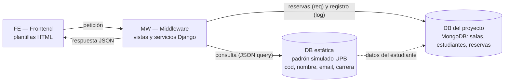

# Reserva de Salas de Estudio — UPB Santa Cruz

Proyecto **P02 — Reservas de salas e instalaciones** de Ingeniería de Software, adaptado a las salas de estudio de la UPB Santa Cruz.

Hoy las reservas de salas llegan por mensajes, lo que provoca cruces de horario y cancelaciones que no se reflejan a tiempo. El sistema registra salas, estudiantes y reservas, y aplica las reglas acordadas con el docente (que actúa como cliente) **antes** de confirmar una reserva.

- **Estado:** incremento de las sesiones 8 y 9 (modificar una reserva). Última actualización: 07/10/2026.
- **Tecnología:** Python 3, Django 5.2 y MongoDB (`django-mongodb-backend`), pruebas con pytest.
- **Datos:** todos los datos de demostración son ficticios.

## Integrantes

| Integrante | Rol principal |
|---|---|
| Raúl Vaca | Backend: reglas de negocio, pruebas e integración |
| Hugo Zúñiga | Arquitectura Django + MongoDB actual y pantallas (`login`, `inicio`, panel de administrador) |
| Alejandro Párraga | Frontend: pantallas del estudiante (tarea C del plan 8-9) |

Docente y cliente: Ing. Sergio Barrientos.

## Arquitectura

Recorrido que explicó el docente en la pizarra: el frontend pide datos al middleware; este confirma la identidad del estudiante en un padrón estático (que simula el de la universidad, con unos 15 estudiantes) y guarda las reservas en la base del proyecto.



| Capa | Dónde está en el código | Estado |
|---|---|---|
| FE | `reservas/templates/web/` y `reservas/static/css/estilos.css` | Hecho: login, calendario del estudiante y panel de administrador |
| MW | `reservas/views.py` (vistas y APIs JSON), `reservas/services.py` (reglas), `reservas/permisos.py` | Hecho; la modificación de reservas se agregó en este incremento |
| DB estática (padrón) | — | **Pendiente.** Hoy el login usa usuarios de Django con contraseña (ver bitácora) |
| DB del proyecto | `reservas/models.py`: `Estudiante`, `Sala`, `Reserva` | Hecho (MongoDB) |

> Hay dos capas con las mismas reglas de creación: `reservas/services.py` (la usan `poblar_bd` y la modificación) y `proyecto/clases/` (la usan la API de reservar y las pruebas anteriores). Unificarlas es un pendiente.

## Qué hace hoy

| Requisito del encargo | Estado |
|---|---|
| RES-01 Registrar espacios y solicitantes | Parcial: salas (nombre y mantenimiento) y estudiantes. Falta la **capacidad** de la sala. |
| RES-02 Consultar disponibilidad | Parcial: calendario por fecha y sala. Sin filtro por capacidad. |
| RES-03 Crear reserva | Parcial: estudiante, sala, fecha y horario. Faltan los **asistentes**. |
| RES-04 Reglas antes de confirmar | Parcial: 15 min de desalojo, sin cruces del mismo estudiante, matrícula al día, sala sin mantenimiento. Falta capacidad. |
| RES-05 Modificar o cancelar | Cancelar: hecho. Modificar: **backend y pruebas hechos en este incremento**; la pantalla del estudiante está pendiente (tarea C). |
| RES-06 Bloqueos de mantenimiento | Parcial: una sala se pone o se quita de mantenimiento. No hay bloqueos por período ni se cancelan las reservas afectadas. |
| RES-07 Corregir con motivo e historial | Pendiente. |
| RES-08 Agenda, activas y cancelaciones | Parcial: calendario del día y registro de reservas en el panel de administrador, con filtro por estado. |

Reglas aprobadas por el docente: ver [`docs/sesion-06-requisitos.md`](docs/sesion-06-requisitos.md). Modelo del flujo de modificación: [`docs/sesion-07-modelos.md`](docs/sesion-07-modelos.md). Plan del incremento: [`docs/sesion-08-09-plan.md`](docs/sesion-08-09-plan.md).

## Instalación

Guía completa, con tres formas de tener MongoDB (Atlas, Docker o instalación local): [`docs/SETUP.md`](docs/SETUP.md). Resumen para Windows y PowerShell:

```powershell
git clone https://github.com/raulandres24/campus-challenge-equipo-01
cd campus-challenge-equipo-01
python -m venv .venv
.venv\Scripts\Activate.ps1
python -m pip install -r requirements.txt
Copy-Item .env.example .env      # luego elige tu MONGO_URI dentro del archivo
python manage.py migrate
python manage.py poblar_bd
```

MongoDB debe funcionar como **replica set** (`rs0`); `docker compose up -d` lo deja listo, y MongoDB Atlas ya lo es.

## Ejecución

```powershell
python manage.py runserver
```

Abre <http://127.0.0.1:8000/>. Usuarios de demostración creados por `poblar_bd` (contraseña `password`, **solo para desarrollo**):

- Docente (administrador): `sbarrientos`
- Administradores del equipo: `rvaca`, `aparraga`, `hugozuniga770`, `admin`
- Estudiantes: `lucia.mendez`, `valeria.flores`, `daniela.castro`

### API para modificar una reserva

`POST /api/modificar-reserva/` (sesión iniciada) con `reserva_id`, `fecha` (`AAAA-MM-DD`), `hora_inicio` y `hora_fin` (`HH:MM`). Puede hacerlo el dueño de la reserva o un administrador.

| Resultado | Respuesta |
|---|---|
| Aceptada | `estado: "CONFIRMADA"` y los datos nuevos de la reserva |
| Rechazada por reglas | `estado: "RECHAZADA"`, la causa en `mensaje`, `preguntar_mantener: true`, `pregunta: "¿Deseas mantenerla?"` y los datos originales (sin cambios). Si el estudiante responde "No" o Esc, la pantalla llama a `/api/cancelar/`. |
| La reserva ya comenzó | `estado: "RECHAZADA"` con `preguntar_mantener: false` |
| Datos mal escritos / sin permiso | HTTP 400 / HTTP 403 |

## Pruebas

```powershell
python -m pytest -q
```

Las pruebas que usan MongoDB trabajan sobre una base aparte, `test_<MONGO_DB_NAME>`, que se crea y se borra en cada corrida: **la base real no se modifica**. Las pruebas puras corren sin MongoDB:

```powershell
python -m pytest -q tests/test_urls.py
```

| Archivo | Qué prueba |
|---|---|
| `tests/test_unitarios_simples.py` | Horarios, validación de estudiante y sala, permisos |
| `tests/test_integracion_completa.py` | Crear, rechazar y cancelar reservas en MongoDB |
| `tests/test_reglas.py` | Reglas de la versión orientada a objetos |
| `tests/test_modificar_reserva.py` | RES-05: casos normal, borde, límite de 15 min, rechazo con la reserva intacta, reserva ya iniciada, reintento y API |
| `tests/test_urls.py` | Botón "Salir" (cerrar sesión) |

## Estructura

```text
reservas_upb/     Configuración de Django (settings, URLs raíz)
reservas/         App principal: modelos, vistas, servicios (reglas), permisos, plantillas
proyecto/clases/  Funciones de negocio usadas por la API de reservar y por las pruebas anteriores
tests/            Pruebas con pytest
docs/             Requisitos, modelos, planes por sesión y guía de instalación
docker-compose.yml  MongoDB local con replica set rs0
```

## Bitácora de decisiones

| Fecha | Decisión | Motivo | Estado |
|---|---|---|---|
| 30/09/2026 y 01/10/2026 | Raúl pidió al docente acceso al padrón de estudiantes de la UPB. | Validar que quien reserva existe y tiene matrícula vigente. | Respondida el 02/10/2026 (fila siguiente). |
| 01/10/2026 | Reglas aprobadas por el docente: 15 min de desalojo, sin cruces del mismo estudiante, solo matrícula al día, no modificar una reserva iniciada, "¿Deseas mantenerla?" ante un cambio rechazado, gana la primera solicitud y el mantenimiento cancela reservas afectadas. | Entrevista con el cliente (sesión 6). | Aprobadas; varias siguen pendientes de implementar (ver "Qué hace hoy"). |
| 01/10/2026 | Se conecta Django con MongoDB (`django-mongodb-backend`), en lugar de MySQL/MariaDB que menciona el encargo. | Por completar. | Vigente en el código. **Por confirmar** la aprobación del docente. |
| 02/10/2026 | **No usar el padrón real**: usar una base estática con los estudiantes del aula. | Indicación del docente (pizarra: FE → MW → DB estática → DB del proyecto). | Aprobada; implementación pendiente. Falta confirmar con el docente si se usan datos reales o ficticios (el repositorio es público). |
| 02/10/2026 | Raúl usó Tailwind CSS en sus plantillas; Hugo hizo las suyas con CSS propio, sin Tailwind. | Dos estilos de trabajo en paralelo. | **Pendiente de charla con el equipo.** Hoy `main` usa CSS propio. |
| 02/10/2026 | Hugo reescribió el proyecto a su estilo; `main` perdió el trabajo posterior de Raúl (login por padrón, roles, capacidad, Tailwind). Ese trabajo quedó en la rama local `respaldo-raul`. | Reescritura sin integración previa. | El equipo se adapta a la versión de Hugo y porta lo útil desde `respaldo-raul`. |
| 02/10/2026 | Modelo del flujo "modificar una reserva" (RES-CU-01). | Sesión 7. | Vigente. |
| 06/10/2026 | Alcance y plan del incremento de las sesiones 8 y 9: modificar una reserva (RES-05). | Sesiones 8-9. | Backend hecho el 07/10/2026; pantalla pendiente. |
| 07/10/2026 | Arreglo del botón "Salir": se quitó `django.contrib.auth.urls`, cuyos nombres `login` y `logout` tapaban a los del proyecto. | El enlace llevaba a `/accounts/logout/`, que solo acepta POST (error 405). | Hecho. |
| 07/10/2026 | Las pruebas usan una base aparte (`test_...`) que se borra al terminar. | El encargo pide probar sin modificar una base real. | Hecho. |
| 07/10/2026 | `requirements.txt` pasa de UTF-16 a UTF-8 y se agrega `docker-compose.yml`; se recomienda MongoDB Atlas para quien instala por primera vez. | Instalación reproducible para el docente. | Hecho. |
| 07/10/2026 | La modificación de reservas va en `reservas/services.py` y reutiliza las reglas de creación sin que la reserva choque consigo misma. Mientras no se aclare, rige "solo antes de que comience" (sesión 6). | Plan 8-9, tarea B. | Hecho; regla provisional. |
| 07/10/2026 | El dueño de una reserva se reconoce por nombre y apellido **exactos** y no vacíos. | Antes, un usuario sin nombre pasaba como dueño de cualquier reserva. | Hecho; se reemplaza al enlazar el login con el padrón. |

## Pendientes y limitaciones

**Preguntas abiertas al docente**

- ¿Sigue vigente "modificar hasta 10 minutos después de crearla" (sesión 4) o la reemplaza "hasta que empiece" (sesión 6)?
- Si el estudiante presiona Esc por error en "¿Deseas mantenerla?", ¿pierde la reserva?
- ¿Se acepta una reserva con asistentes igual a la capacidad?
- ¿Se puede cancelar una reserva ya iniciada? ¿Se puede mover una reserva a un horario pasado?
- ¿El aviso de mantenimiento es por correo o por WhatsApp? (El encargo no exige enviar mensajes reales.)
- ¿El padrón estático lleva datos reales del aula o ficticios?

**Trabajo pendiente**

- Padrón estático y login contra el padrón (enlaza el usuario con su código de estudiante).
- Pantalla del estudiante para modificar su reserva (tarea C).
- Capacidad de sala y asistentes (RES-01, RES-03, RES-04).
- Orden de llegada de solicitudes simultáneas (RES-RF-07), bloqueos por período (RES-06), historial de correcciones (RES-07) y agenda por sala (RES-08).
- Unificar `reservas/services.py` y `proyecto/clases/`.
- Actualizar `docs/BRECHA_REQUISITOS.md`, `docs/AUTENTICACION.md` y `docs/CONFIGURACION_DJANGO.md`, que describen una versión anterior.

**Limitaciones conocidas**

- Hoy un estudiante puede escribir el código de otro en el formulario de reserva; se corrige al enlazar el login con el padrón.
- `api_editar_reserva` (administrador) cambia reservas sin validar reglas.
- Las contraseñas de demostración (`password`) y la `SECRET_KEY` por defecto son solo para desarrollo.

## Asistencia utilizada

Parte del código, las pruebas y la documentación del 07/10/2026 se prepararon con asistencia de IA (Claude). Raúl los revisó, aplicó y subió al repositorio.
