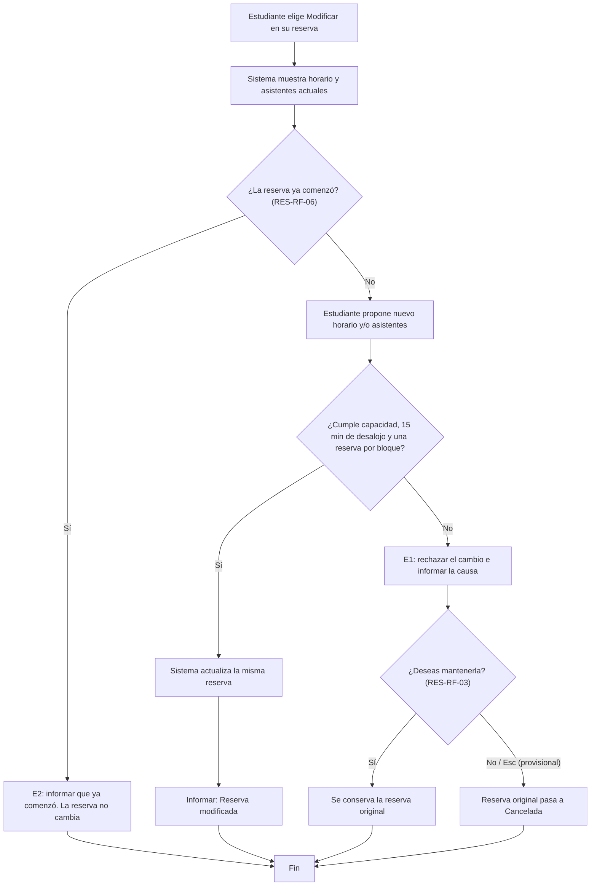

# Sesión 7 — Historias, casos de uso y modelos

- Proyecto: Reserva de Salas de Estudio — UPB Santa Cruz
- Integrantes: Raúl Vaca, Hugo Zúñiga, Alejandro Párraga
- Fecha: 02/10/2026
- Requisitos de origen: [Sesión 6](sesion-06-requisitos.md)
- Flujo seleccionado: **modificar una reserva** (cambiar horario o asistentes de una reserva confirmada).
- IDs seleccionados y estado de aprobación:
  - **RES-RF-03 — Modificación rechazada: confirmar si se mantiene la original** — aprobado por el cliente (ENT-03). El comportamiento al presionar Esc queda **provisional** (ver sección 7).
  - **RES-RF-06 — Modificación solo antes del inicio** — aprobado por el cliente (ENT-08). **Provisional** en cuanto al límite de tiempo, por la contradicción con la regla de la sesión 4 (ver sección 7).
  - Reglas que se reutilizan dentro de la comprobación: RES-RF-01 (15 min de desalojo), RES-RF-02 (una reserva por estudiante en el bloque) y RES-RF-04 (capacidad).

## 1. Historia RES-HU-01

Como **estudiante que tiene una reserva**, quiero **cambiar el horario o la cantidad de asistentes de mi reserva antes de que comience** para **adaptarla a un cambio de planes sin tener que cancelarla y volver a reservar**, y decidir yo si la conservo cuando el cambio no es posible.

- Requisitos relacionados: RES-RF-03, RES-RF-06 (y RES-05 del encargo inicial).

## 2. Caso de uso RES-CU-01 — Modificar una reserva

- Objetivo: actualizar el horario o los asistentes de una reserva cuando el cambio cumple las reglas acordadas.
- Actor principal: estudiante (solicitante dueño de la reserva).
- Disparador: el estudiante elige "Modificar" sobre una de sus reservas.
- Precondiciones:
  - El estudiante inició sesión en el sistema.
  - La reserva existe, está en estado **Confirmada** y pertenece a ese estudiante.
- Poscondición de éxito: la misma reserva (mismo identificador) queda Confirmada con el nuevo horario o asistentes; las demás reservas no cambian.
- Garantía ante rechazo: el nuevo horario nunca se aplica y ninguna otra reserva se altera. La reserva original se conserva intacta, salvo que el estudiante decida cancelarla (E1, opción "No").

> Nota: "la reserva no ha comenzado" y "el nuevo horario no tiene conflictos" **no** son precondiciones; son comprobaciones que el sistema hace durante el flujo (pasos 3 y 6), porque de ellas salen las rutas de rechazo.

### Flujo principal

1. El estudiante selecciona una de sus reservas y elige "Modificar".
2. El sistema muestra la sala, el horario y los asistentes actuales.
3. El sistema comprueba que la reserva no haya comenzado. *(Si ya comenzó → E2.)*
4. El estudiante propone el nuevo horario y/o la nueva cantidad de asistentes.
5. El estudiante confirma la solicitud de cambio.
6. El sistema comprueba las reglas de reserva sobre la propuesta: capacidad de la sala (RES-RF-04), 15 minutos de desalojo frente a las otras reservas activas de la sala (RES-RF-01) y que el estudiante no tenga otra reserva en ese bloque (RES-RF-02). La reserva que se modifica no se compara consigo misma. *(Si alguna regla falla → E1.)*
7. El sistema actualiza el horario y/o los asistentes de la misma reserva.
8. El sistema informa "Reserva modificada" y muestra los datos vigentes. Fin.

### E1 — Cambio rechazado por las reglas de reserva

- Ocurre en el paso: 6.
- Condición: la propuesta incumple al menos una regla (capacidad, desalojo de 15 min o reserva del estudiante en el mismo bloque).
- Respuesta del sistema:
  1. Rechaza el cambio, no aplica el nuevo horario e informa la causa concreta (RES-RC-01).
  2. Pregunta: **"¿Deseas mantenerla?"**
  3. Si el estudiante responde **"Sí"**: la reserva original se conserva sin cambios.
  4. Si responde **"No"** o presiona **Esc**: la reserva original pasa a **Cancelada** y la sala se libera en ese horario. *(Esc: provisional.)*
- Estado final y datos que se conservan: con "Sí", Confirmada con todos sus datos originales; con "No"/Esc, Cancelada (el registro se conserva con su horario original, no se borra). Las demás reservas nunca cambian.
- El caso termina.

### E2 — La reserva ya comenzó

- Ocurre en el paso: 3.
- Condición: la hora actual es igual o posterior a la hora de inicio de la reserva.
- Respuesta del sistema: informa "La reserva ya comenzó y no puede modificarse" (RES-RF-06).
- Estado final y datos que se conservan: Confirmada, sin ningún cambio.
- El caso termina.

## 3. Modelo RES-MOD-01

- Tipo elegido: diagrama de actividad simplificado (flowchart).
- Pregunta que responde: **¿qué cambia y qué se conserva según el resultado de cada comprobación?**
- Alcance y aspectos que deja fuera: no muestra cómo se guarda la información en MongoDB, ni el control de solicitudes simultáneas (RES-RF-07), ni las notificaciones por mantenimiento.

## 4. Estados o efectos sobre los datos

- Entidad que se está modelando: **una reserva** (campo `estado` del modelo `Reserva`: Confirmada / Cancelada).

| Estado actual | Evento y condición | Estado siguiente | Efecto sobre los datos |
|---|---|---|---|
| Confirmada | Modificación válida, antes del inicio | Confirmada | Se actualizan el horario y/o los asistentes de la **misma** reserva. |
| Confirmada | Modificación rechazada (E1) y el estudiante responde "Sí", o la reserva ya comenzó (E2) | Confirmada | Se conservan todos los datos originales. |
| Confirmada | Modificación rechazada (E1) y el estudiante responde "No" o presiona Esc | Cancelada | Se conserva el registro con su horario original; la sala queda libre en ese horario. |

No existe un estado "Rechazada" de la reserva: lo que se rechaza es la **solicitud de modificación**. "Mostrar el error" es una acción del sistema, no un estado.

## 5. Trazabilidad

| Requisito de sesión 6 | Historia / caso de uso | Paso o rama del modelo | Escenario de aceptación relacionado |
|---|---|---|---|
| RES-05 del encargo (modificación válida) | RES-HU-01; RES-CU-01, pasos 6–8 | Rama "Sí" de la comprobación de reglas | Sesión 6, sección 4, caso **Normal**: mover 10:00–12:00 a 08:00–09:30 sin conflictos → modificación aceptada. |
| RES-RF-03 | RES-HU-01; RES-CU-01, E1 | Rama "No" → "¿Deseas mantenerla?" | Sesión 6, caso **Rechazo** RES-RF-03: mover a 12:30–13:50 con otra reserva a las 14:00 → rechazo; con "Sí", la original sigue 10:00–12:00. |
| RES-RF-06 | RES-CU-01, paso 3 y E2 | Rama "Sí" de "¿La reserva ya comenzó?" | Sesión 6, caso **Rechazo** RES-RF-06: a las 10:30 intentar modificar 10:00–12:00 → rechazo; la reserva no cambia. |
| RES-RF-01 | RES-CU-01, paso 6 | Comprobación de reglas | Sesión 6, caso **Límite**: margen exacto de 15 min (13:45 → 14:00) se acepta. |

Los escenarios se han recorrido sobre el modelo; eso no equivale a ejecutar pruebas del programa. La modificación todavía no está implementada.

## 6. Revisión recibida

Opcional en esta sesión; no se realizó revisión de otro equipo.

## 7. Dudas y cambios en los requisitos

| Requisito | Duda o cambio | Estado / confirmación del cliente | Impacto |
|---|---|---|---|
| RES-RF-06 | En la sesión 4 se acordó modificar "hasta 15 minutos después de haber sido realizada"; en la sesión 6, "mientras no haya comenzado". ¿La nueva regla reemplaza a la anterior? | Pendiente de aclaración | El paso 3 y la rama E2 son provisionales; hoy se modela la regla de la sesión 6. |
| RES-RF-03 | Si el estudiante presiona Esc por error, ¿pierde su reserva? | Pendiente de aclaración | La rama "No / Esc" del modelo es provisional. |
| RES-RF-04 | Si los asistentes son iguales a la capacidad, ¿se acepta? | Pendiente de aclaración | No se dibuja como caso límite resuelto dentro de la comprobación del paso 6. |

No hubo cambios aprobados en los requisitos de la sesión 6 durante esta actividad.

## 8. Siguiente paso y participación

- Tarea de desarrollo derivada del modelo: vista `modificar_reserva` en Django que siga el flujo RES-CU-01 (comprobar inicio, validar con las reglas existentes de `Reserva`, preguntar "¿Deseas mantenerla?" ante un rechazo), con sus pruebas.
- Requisito que la justifica: RES-RF-03 y RES-RF-06.
- Responsable inicial: Raúl Vaca (según `docs/REPARTO_TAREAS.md`).
- Issue existente o nuevo, si corresponde: no se creó.
- Aportes de cada integrante: [quién redactó: Hugo y Raul, quién modeló: Hugo y Raul, quién revisó: Hugo y Raul]
- Asistencia de IA: Claude (Anthropic), para proponer la estructura del documento y un primer borrador de la historia, el caso de uso y el diagrama a partir de `docs/sesion-06-requisitos.md`. El equipo revisó que el flujo coincida con lo acordado con el cliente y verificó que el diagrama se vea en GitHub.
