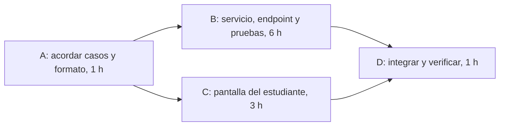

# Sesiones 8 y 9 — Plan del siguiente incremento

- Proyecto: Reserva de Salas de Estudio — UPB Santa Cruz
- Integrantes: Raúl Vaca, Hugo Zúñiga, Alejandro Párraga
- Fecha: 06/10/2026

## 1. Fuentes, flujo elegido e IDs

- Requisitos: [Sesión 6](sesion-06-requisitos.md)
- Modelo: [Sesión 7](sesion-07-modelos.md)
- Brecha detectada: [BRECHA_REQUISITOS.md](BRECHA_REQUISITOS.md) y reparto: [REPARTO_TAREAS.md](REPARTO_TAREAS.md)
- Flujo elegido: **modificar una reserva** — `RES-CU-01` (ruta principal, E1 y E2), historia `RES-HU-01`, modelo `RES-MOD-01`.
- Requisitos relacionados: `RES-RF-06` (solo antes del inicio), `RES-RF-03` (cambio rechazado y "¿Deseas mantenerla?"), `RES-RF-01` (15 min de desalojo) y `RES-RF-02` (una reserva por estudiante en el bloque). Del encargo inicial: `RES-05`.

### Lo que ya existe (punto de partida real)

Revisado en el código de `main` (commit `c78eb20`):

| Pieza | Estado | Dónde |
|---|---|---|
| Crear reserva con 4 reglas: estudiante habilitado, sala sin mantenimiento, una reserva por estudiante en el bloque, 15 min de desalojo | Implementado | `reservas/services.py` (`reservar_si_esta_disponible`) |
| Detección de choque con margen de 15 min y de solapamiento del estudiante | Implementado | `reservas/models.py` (`Reserva.choca_con`, `solapa_estudiante`) |
| Cancelar una reserva (dueño o administrador) y botón de cancelar en la vista del estudiante | Implementado | `reservas/views.py` (`api_cancelar_reserva`), `reservas/templates/web/inicio.html` |
| Editar una reserva | **Parcial**: solo administradores; mueve fecha, sala y horas **sin comprobar** conflictos, 15 min ni si la reserva ya comenzó | `reservas/views.py` (`api_editar_reserva`) |
| Modificar la propia reserva siguiendo `RES-CU-01` (validar, rechazar con causa, conservar la original) | **No existe** | — |
| Pantalla para que el estudiante modifique su reserva | **No existe** | — |
| Pruebas de modificación | **No existen** (hay 10 de integración sobre crear, rechazar y cancelar, y pruebas unitarias) | `tests/` |

> `BRECHA_REQUISITOS.md` dice que RES-05 "falta por completo". Es más exacto decir que **cancelar existe y modificar es parcial** (solo administrador y sin validaciones). Conviene corregir ese archivo.

Resultados de `pytest`: **no registrados** para este plan (las pruebas de integración necesitan MongoDB local).

## 2. Alcance del incremento

**Resultado observable:** un estudiante puede cambiar la fecha y el horario de **su propia** reserva antes de que comience, desde la pantalla de reservas. Si el cambio cumple las reglas, solo esa reserva cambia. Si no, ve la causa del rechazo y la pregunta "¿Deseas mantenerla?", y la reserva original queda intacta salvo que responda "No" o presione Esc (en ese caso se cancela, según lo acordado con el docente).

**Incluye:**
- Función de servicio que valida antes de guardar y reutiliza las reglas de creación (`RES-RF-01`, `RES-RF-02`, estudiante habilitado, sala disponible), sin que la reserva choque consigo misma.
- Regla "la reserva ya comenzó" (`RES-RF-06`).
- Endpoint para el estudiante dueño de la reserva, con el resultado y la causa del rechazo (`RES-RC-01`).
- Pantalla del estudiante para modificar su reserva, con el diálogo "¿Deseas mantenerla?"; "No" o Esc usa el endpoint de cancelar que ya existe.
- Pruebas de: caso aceptado, nuevo horario que se solapa con el anterior de la misma reserva, límite exacto de 15 min, conflicto con conservación de datos y reserva ya iniciada.

**Casos concretos (misma sala y mismo día; basados en la sesión 6):**

| Caso | Situación inicial | Acción | Resultado esperado |
|---|---|---|---|
| Normal | Reserva R1 de 10:00–12:00; son las 07:00 | Mover R1 a 08:00–09:30 | Aceptado; solo cambia R1 |
| Borde | R1 de 10:00–12:00; son las 07:00 | Mover R1 a 11:00–13:00 (se solapa con su propio horario anterior) | Aceptado: la reserva no choca consigo misma |
| Límite | R1 de 10:00–12:00 y R2 de 14:00–15:00 | Mover R1 a 12:30–13:45 (15 min exactos antes de R2) | Aceptado |
| Rechazo | Igual que el límite | Mover R1 a 12:30–13:50 | Rechazado por desalojo; R1 conserva fecha, horas y estado; R2 no cambia; se pregunta "¿Deseas mantenerla?" |
| Rechazo (ya comenzó) | R1 de 10:00–12:00; son las 10:30 | Mover R1 a 11:00–13:00 | Rechazado: la reserva ya comenzó; R1 no cambia |

**Fuera de este incremento (temporal; siguen siendo obligaciones del proyecto):**
- Modificar la **cantidad de asistentes** y validar capacidad (`RES-RF-04`): en el modelo Django actual `Sala` no tiene capacidad y `Reserva` no tiene asistentes. Hay que decidir cómo se incorporan. Por eso `RES-RF-03` queda completa solo para cambios de fecha y horario.
- Reglas del endpoint de administrador `api_editar_reserva` (hoy no valida nada).
- Bloqueos de mantenimiento y avisos (`RES-06`), historial de correcciones (`RES-07`), agenda por sala (`RES-08`).

**Dependencias y supuestos:**
- Dependencia técnica: `_verificar_una_reserva_por_dia` y `_verificar_disponibilidad_sala` revisan **todas** las reservas confirmadas, incluida la que se modifica. Hay que agregarles un parámetro para excluirla; sin eso toda modificación se rechazaría por chocar consigo misma.
- Dependencia entre tareas: la pantalla (tarea C) necesita el formato de respuesta del endpoint que se acuerda en la tarea A. Puede construirse antes de que el endpoint esté terminado, pero se comprueba contra él en la tarea D.
- Supuesto de interfaz: la pantalla se hace con Tailwind (decisión de Alejandro). En el código actual `inicio.html` usa `static/css/estilos.css` y **no se encontró Tailwind en las plantillas** (solo se menciona en `docs/`), así que puede haber que incorporarlo.
- Supuesto: "ya comenzó" significa que `fecha + hora_inicio` es menor o igual a la hora actual (`TIME_ZONE = 'America/La_Paz'` en `settings.py`).
- Supuesto: el dueño de la reserva se identifica igual que en `api_cancelar_reserva`.
- **Duda sin resolver (regla provisional):** en la sesión 4 el docente indicó que se modifica "hasta 10 minutos después de haber sido realizada"; en la sesión 6, "mientras no haya comenzado". Este plan usa la regla de la sesión 6. Si cambia a "10 minutos", se ajusta la tarea B usando `creado_en`.

## 3. Tareas

**Disponibilidad (según Raúl):**
- **Raúl:** 4 horas libres el día 1 y 2 horas el día 2 antes de la presentación, es decir, **6 horas** en total.
- **Alejandro:** se hace cargo del frontend (tarea C).
- **Hugo:** sin disponibilidad para este incremento, por lo que Raúl asume el backend, las pruebas y la integración.

Las horas del plan son relativas desde `t = 0`, no fechas.

| Tarea | Trabajo y evidencia de terminación | Esfuerzo | Duración | Predecesoras | Responsables |
|---|---|---:|---:|---|---|
| A | Acordar los casos de la sección 2 con fecha y hora concretas y el formato de respuesta del endpoint; preguntar al docente la duda de los 10 minutos. **Evidencia:** casos y formato escritos en `docs/`, y respuesta del docente registrada (o duda marcada como pendiente). | 1 h-p | 1 h | Ninguna | Raúl |
| B | Parámetro para excluir la reserva propia en las dos reglas, regla "ya comenzó", función `modificar_reserva_si_esta_disponible`, endpoint para el dueño y 5 pruebas (los 5 casos de la sección 2). **Evidencia:** código y pruebas en una rama listos para integrar. | 6 h-p | 6 h | A | Raúl |
| C | Pantalla del estudiante con Tailwind: botón Modificar en sus reservas, formulario de fecha y horas, causa del rechazo y diálogo "¿Deseas mantenerla?" ("No" o Esc cancela con el endpoint existente). **Evidencia:** plantilla que funciona contra el formato de A, revisada por Raúl. | 3 h-p | 3 h | A | Alejandro; revisa Raúl |
| D | Integrar B y C, ejecutar la suite completa (10 de integración + nuevas), probar el recorrido en pantalla, corregir diferencias y escribir cómo demostrar el flujo. **Evidencia:** versión identificada con pruebas pasando e instrucciones. | 2 h-p | 1 h | B y C | Raúl y Alejandro |

Esfuerzo total: **12 h-p**.

**Por qué esas estimaciones y qué las cambiaría:**
- **A (1 h-p, 1 h):** ahora lo hace una sola persona; los casos base ya están en las sesiones 6 y 7. Cambia si hay que volver a consultar al docente.
- **B (6 h-p, 6 h):** reutiliza las cuatro reglas de creación, pero hay que modificar dos, añadir una regla nueva y un endpoint (unas 4 h), más 5 pruebas con datos en MongoDB (unas 2 h). No se registraron horas de tareas anteriores (**no registradas**), así que la estimación se basa en el tamaño del código a tocar, no en un dato medido. Subiría si hay que rehacer la identificación del dueño o si la regla pasa a ser "10 minutos".
- **C (3 h-p, 3 h):** estimación propuesta para una plantilla con formulario, mensajes y un diálogo; **Alejandro debe confirmarla**. Subiría 1 h si hay que incorporar Tailwind a las plantillas actuales.
- **D (2 h-p, 1 h):** Raúl y Alejandro participan una hora. Si aparece una corrección no prevista se registra y se revisa la estimación.

## 4. Red, tiempos, ruta crítica y Gantt

Horas desde `t = 0`. Meta del recorrido hacia atrás: fin temprano de D = **8 h**.

| Tarea | Duración | IT | FT | ITa | FTa | Holgura |
|---|---:|---:|---:|---:|---:|---:|
| A | 1 | 0 | 1 | 0 | 1 | 0 |
| B | 6 | 1 | 7 | 1 | 7 | 0 |
| C | 3 | 1 | 4 | 4 | 7 | 3 |
| D | 1 | 7 | 8 | 7 | 8 | 0 |

- D comienza en `max(7, 4) = 7`. A debe terminar a más tardar en `min(1, 4) = 1`.
- **Ruta crítica: A → B → D** = 1 + 6 + 1 = **8 h**. La otra ruta, A → C → D, suma 1 + 3 + 1 = 5 h.
- C tiene 3 h de holgura **bajo estos supuestos iniciales**; no es un margen garantizado ni horas-persona adicionales.
- Duración inicial del incremento: **8 h**. Esfuerzo total: **12 h-p**.

**Gantt inicial**

| Tarea | 0–1 h | 1–2 h | 2–3 h | 3–4 h | 4–5 h | 5–6 h | 6–7 h | 7–8 h |
|---|---|---|---|---|---|---|---|---|
| A | ■ | | | | | | | |
| B | | ■ | ■ | ■ | ■ | ■ | ■ | |
| C | | ■ | ■ | ■ | | | | |
| D | | | | | | | | ■ |

## 5. Comprobación de disponibilidad

**Solapamiento entre personas:** no hay conflicto. B (Raúl) y C (Alejandro) coinciden entre las horas 1 y 4, pero las hacen personas distintas. Las tareas de Raúl (A, B, D) son consecutivas. En D coinciden Raúl y Alejandro, y para entonces C ya terminó.

**Conflicto de capacidad:** sí lo hay. Raúl necesita **8 h** de trabajo (A 1 h + B 6 h + D 1 h) y tiene **6 h** disponibles antes de la presentación. Como Hugo no está disponible, nadie más puede tomar el backend.

| Hora del plan | Situación prevista |
|---|---|
| 0–6 (hasta la presentación) | A terminada; B con 5 de 6 h hechas; C terminada por Alejandro |
| 6–8 (después de la presentación) | Queda 1 h de B (las pruebas pendientes) y D (integración y verificación) |

**Consecuencia:** el hito de la sección 7 **no se alcanzaría antes de la presentación**; se alcanzaría con 2 h más de trabajo de Raúl. Decisión provisional: mantener el alcance y mostrar en la presentación lo que ya esté hecho, con su límite explícito. Si el equipo prefiere cumplir el hito antes de la presentación, tendría que sacar trabajo del alcance (por ejemplo, dejar para después la regla "ya comenzó" y su prueba) y recalcular este plan.

**Contingencias:**
- **Si Alejandro no estuviera disponible,** Raúl haría C después de B:

| Tarea | Inicio | Fin |
|---|---:|---:|
| A | 0 | 1 |
| B | 1 | 7 |
| C | 7 | 10 |
| D | 10 | 11 |

El final previsto pasaría de **8 h a 11 h**.
- **Si Raúl no estuviera disponible,** el plan se detiene: no hay otra persona disponible con conocimiento del backend. Es el principal punto débil del plan (riesgo 2).

**Conocimiento necesario:** B requiere leer `services.py`, `models.py` y `views.py`, y Raúl confirma que los domina. C requiere conocer las plantillas del estudiante (`inicio.html`) y el formato de respuesta acordado en A.

## 6. Riesgos

| Riesgo | Probabilidad y razón | Consecuencia | Respuesta antes del problema | Señal y contingencia | Responsable |
|---|---|---|---|---|---|
| El docente confirma que la regla vigente es "10 minutos después de hacer la reserva" (o cambia lo de Esc), y la regla "ya comenzó" cambia | **Media**: ya hubo dos respuestas distintas entre la sesión 4 y la sesión 6 | Se reescriben la regla de B y sus pruebas, y puede cambiar el mensaje de la pantalla de C; sube la duración de B | Hacer la pregunta en la tarea A y dejar la regla aislada en una sola función | Señal: respuesta del docente distinta a la sesión 6. Se actualizan `RES-RF-06`, `RES-CU-01` y este plan | Raúl |
| Raúl concentra A, B y D (8 h de trabajo) y solo tiene 6 h antes de la presentación; Hugo no está disponible | **Alta**: la propia suma de horas no cabe en la ventana disponible | El hito se retrasa 2 h de trabajo más allá de la presentación; si Raúl falla, el plan se detiene | Hacer primero la función de servicio y su prueba principal, y dejar para el final la regla "ya comenzó" y su prueba | Señal: a la hora 4 (fin del día 1) B no tiene la función de servicio hecha. Contingencia: recortar la regla "ya comenzó" a un incremento posterior y avisar al docente | Raúl |

## 7. Entregable, hito y estado real

**Entregable:** versión identificada (commit) de la modificación de reservas, con pantalla, pruebas e instrucciones para demostrarla.

**Hito verificable:** revisión completada sobre esa versión en la que (1) mover una reserva propia a un horario permitido cambia solo esa reserva, (2) un horario que viola los 15 min devuelve rechazo con la causa, muestra "¿Deseas mantenerla?" y deja intactas la reserva original y las demás, (3) intentar modificar una reserva ya iniciada se rechaza, y (4) las pruebas pasan sobre esa misma versión.

**Estado real al cerrar esta actividad:**

| Tarea | Estado | Evidencia o explicación | Horas reales |
|---|---|---|---|
| A | No iniciada | Las sesiones 6 y 7 ya dejan los casos base; faltan fechas concretas y el formato de respuesta | No registradas |
| B | No iniciada | `api_editar_reserva` existe pero no cumple `RES-CU-01` | No registradas |
| C | No iniciada | No hay pantalla para modificar la propia reserva | No registradas |
| D | No iniciada | Depende de B y C | No registradas |

El plan no demuestra que el hito se alcanzó: hoy solo están escritos los requisitos y el modelo.

## 8. Siguiente acción y condición de revisión

- **Siguiente acción:** Alejandro se encarga del frontend (tarea C) con Tailwind. Arranca cuando Raúl entregue el formato de respuesta de la tarea A (hora 1). **Revisión:** Raúl revisa el resultado al terminar C.
- **Condición que obligaría a revisar el plan:** que el docente cambie la regla de cuándo se puede modificar, que B supere las 6 h sin tener la función de servicio lista, o que Alejandro o Raúl dejen de estar disponibles.

## 9. Cambios y dudas respecto de requisitos anteriores

| Requisito | Duda o cambio | Estado | Impacto en el plan |
|---|---|---|---|
| `RES-RF-06` | Sesión 4: modificar hasta 10 min después de hacer la reserva. Sesión 6: mientras no haya comenzado | Pendiente de aclaración | Regla provisional (riesgo 1) |
| `RES-RF-03`, `RES-RF-04` | El modelo Django no tiene capacidad de sala ni asistentes | Pendiente de decisión del equipo | Quedan fuera de este incremento |
| `RES-RF-03` | Si el estudiante presiona Esc por error, pierde su reserva (así se acordó) | Acordado; falta confirmar si se quiere evitar la cancelación accidental | La pantalla de C sigue lo acordado |

## 10. Participación y asistencia utilizada

- Aportes de cada integrante:
  - Estimó: Raúl Vaca y Alejandro Párraga.
  - Calculó la red: Raul Vaca
  - Revisó: Raul Vaca
  - Hugo Zúñiga: sin disponibilidad en este periodo; la disponibilidad y el reparto los informó Raúl.
